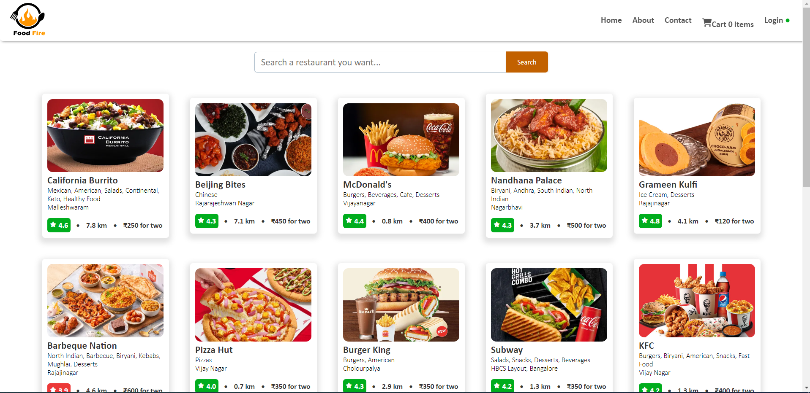
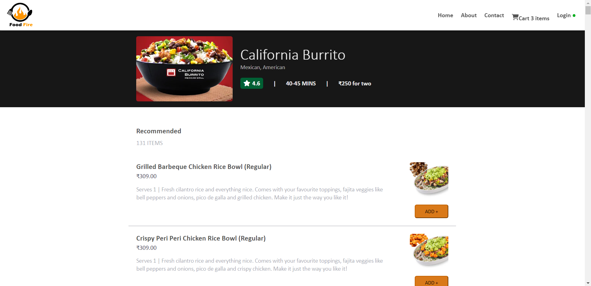
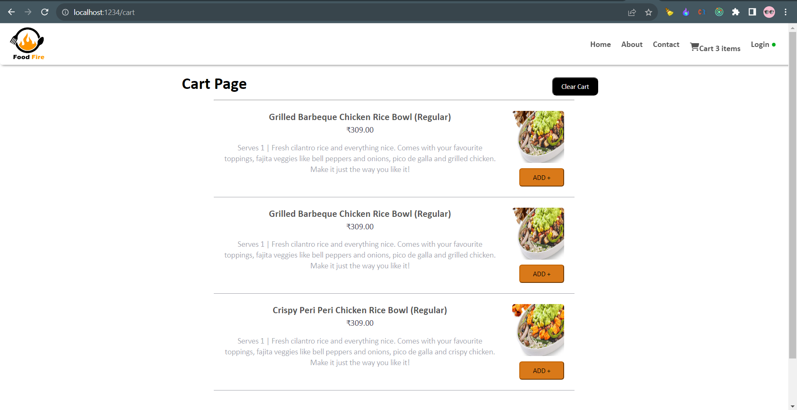

# OnlineFood Order

Built a functional online food order application, having like food search, search restaurant, and user interaction. Utilized React.js and modern web development practices to ensure a smooth and responsive user experience.

## Run Locally

Clone the project

```bash
  git clone https://github.com/Balajiyatheysh/foodOrder.git
```

Go to the project directory

```bash
  cd my-project
```

Install dependencies

```bash
  npm install
```

Start the server

```bash
  npm run start
```

# Types of testing 
 - Unit testing 
 - Integration testing
 - End to end testing

# Setting up testing in our app
  - Install React Testing Library
  - Installed jest
  - Installed Babel dependecies
  - Configure Babel
  - Configure Parcel Config file to disable default babel transpilation
  - Jest Configuration
  - Jest - npx jest --init
  - Install jsdom library
  - Install @babel/preset-react - to make JSX work in test cases
  - Include @babel/preset-react inside babel config file
  - Install @testing-library/jest-dom


## Screenshots








## Feedback

If you have any feedback, please reach out to us at balajiyatheysh87@gmail.com

